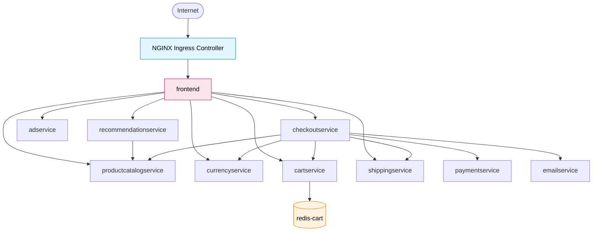
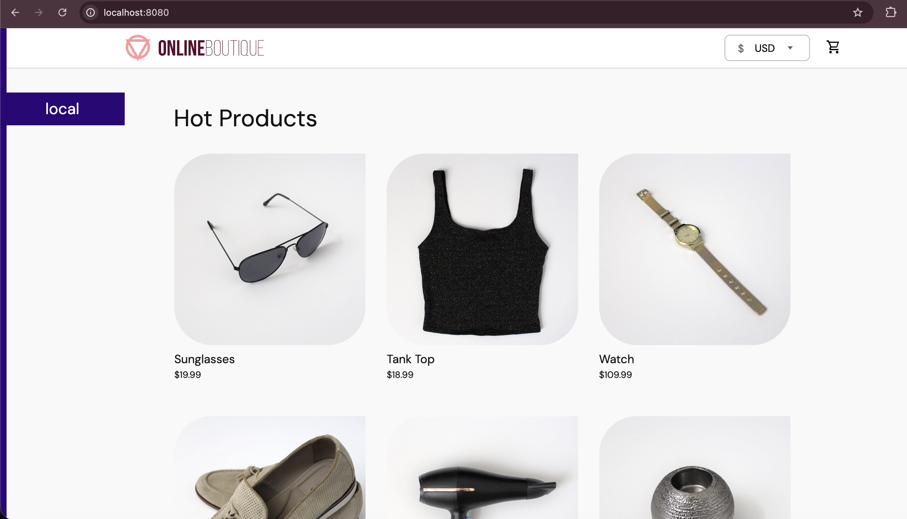
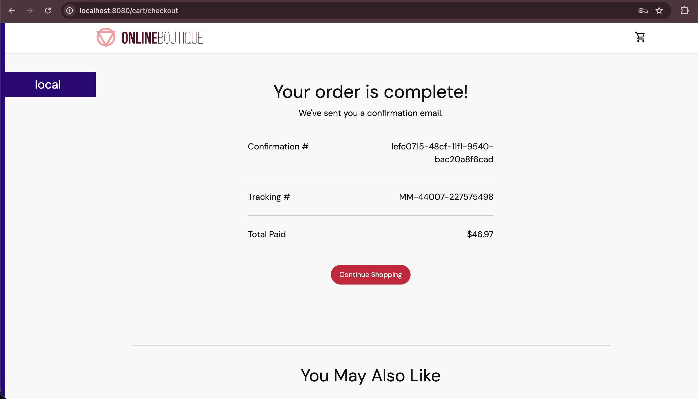
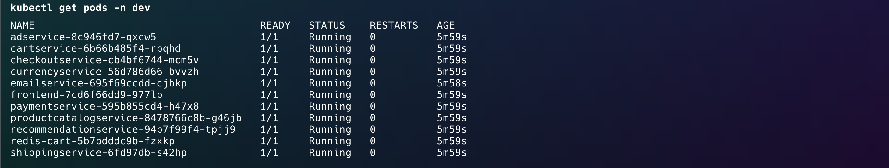
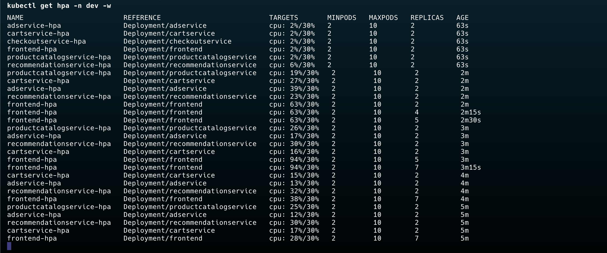
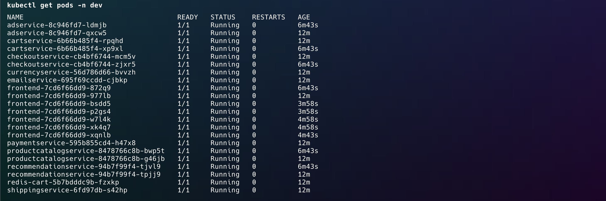

# Kubernetes Microservices Application Deployment

A custom Helm chart for deploying 10 core Online Boutique microservices on Kubernetes with Redis, HPA, NetworkPolicy, Ingress, TLS automation, and k6-based load testing.

This project uses the official Google Online Boutique container images, but the Kubernetes deployment logic is implemented manually through a custom Helm chart. The goal is to practice production-oriented Kubernetes patterns, including service discovery, environment-specific configuration, autoscaling, traffic routing, certificate management, network isolation, and namespace-scoped access control.

## Project Overview

This project deploys the core services of the Google Online Boutique microservices demo application using a custom Helm chart.

The deployment includes:

- `frontend`
- `productcatalogservice`
- `currencyservice`
- `cartservice`
- `recommendationservice`
- `shippingservice`
- `paymentservice`
- `emailservice`
- `checkoutservice`
- `adservice`
- `redis-cart`

The original Online Boutique demo also includes a built-in `loadgenerator` service. In this project, load generation is handled separately using `k6`, which makes HPA testing explicit, repeatable, and easier to control.

## Architecture



## Key Features

- Custom Helm chart for a multi-service Kubernetes application
- Reusable `deployment.yaml` template using Helm `range`
- Reusable `service.yaml` template using Helm `range`
- Environment-specific configuration with `values-dev.yaml` and `values-prod.yaml`
- Redis deployment with optional persistence
- NGINX Ingress support
- TLS automation with cert-manager and Let's Encrypt
- Horizontal Pod Autoscaler configuration
- k6 load testing for HPA validation
- NetworkPolicy rules based on service-to-service communication
- Namespace-scoped RBAC for developer access
- ServiceAccount support for application workloads
- Bash scripts for installation, deployment, testing, port-forwarding, and cleanup

## Tech Stack

- Kubernetes
- Helm
- AWS EKS
- NGINX Ingress Controller
- cert-manager
- Let's Encrypt
- Redis
- k6
- RBAC
- NetworkPolicy
- Bash scripting

## Repository Structure

```text
microservices-k8s-deploy/
├── README.md
├── .gitignore
│
├── charts/
│   └── online-boutique-custom/
│       ├── Chart.yaml
│       ├── values.yaml
│       ├── values-dev.yaml
│       ├── values-prod.yaml
│       └── templates/
│           ├── _helpers.tpl
│           ├── NOTES.txt
│           ├── deployment.yaml
│           ├── service.yaml
│           ├── redis.yaml
│           ├── ingress.yaml
│           ├── hpa.yaml
│           ├── networkpolicy.yaml
│           ├── serviceaccount.yaml
│           └── rbac.yaml
│
├── cluster-addons/
│   ├── ingress-nginx/
│   │   └── values.yaml
│   └── cert-manager/
│       ├── values.yaml
│       └── cluster-issuer.yaml
│
├── scripts/
│   ├── install-ingress-nginx.sh
│   ├── install-cert-manager.sh
│   ├── deploy-dev.sh
│   ├── deploy-prod.sh
│   ├── test-hpa.sh
│   ├── port-forward.sh
│   └── clean.sh
│
├── tests/
│   └── k6/
│       └── load-test.js
│
└── assets/
    └── screenshots/
        ├── 01-frontend-browser.png
        ├── 02-order-confirmation.png
        ├── 03-pods-running-baseline.png
        ├── 04-hpa-scaling.png
        └── 05-pods-after-scaling.png
```

## Prerequisites

Install the following tools before running the project:

- `kubectl`
- `Helm 3`
- `Docker`
- `Minikube`, `kind`, or an EKS cluster
- `k6`, for load testing
- A real domain, only if testing production TLS with Let's Encrypt

For local testing, Minikube is enough for the basic deployment.

NetworkPolicy enforcement requires a CNI plugin that supports NetworkPolicy, such as Calico or Cilium. Applying NetworkPolicy manifests alone does not guarantee enforcement if the cluster CNI does not support it.

## Quick Start

### 1. Clone the repository

```bash
git clone https://github.com/pouyaarjomandi/microservices-k8s-deploy.git
cd microservices-k8s-deploy
```

### 2. Make scripts executable

```bash
chmod +x scripts/*.sh
```

### 3. Deploy to the dev namespace

```bash
./scripts/deploy-dev.sh
```

This installs the Helm chart into the `dev` namespace using `values-dev.yaml`.

### 4. Access the frontend locally

```bash
./scripts/port-forward.sh dev
```

Then open:

```text
http://localhost:8080
```

## Manual Helm Commands

Render the chart locally:

```bash
helm template boutique-dev charts/online-boutique-custom \
  -f charts/online-boutique-custom/values-dev.yaml
```

Install or upgrade manually:

```bash
helm upgrade --install boutique-dev charts/online-boutique-custom \
  --namespace dev \
  --create-namespace \
  -f charts/online-boutique-custom/values-dev.yaml
```

Check application resources:

```bash
kubectl get pods -n dev
kubectl get svc -n dev
kubectl get all -n dev
```

## Environment Configuration

The chart uses separate values files for different environments.

### Default values

```text
charts/online-boutique-custom/values.yaml
```

This file contains the base configuration for all services.

### Development values

```text
charts/online-boutique-custom/values-dev.yaml
```

Used for local or development deployment.

### Production values

```text
charts/online-boutique-custom/values-prod.yaml
```

Used for production-style deployment. It enables or configures:

- Higher resource requests and limits
- Multiple replicas
- Redis persistence
- Ingress and TLS
- HPA
- NetworkPolicy
- Read-only RBAC for developers

## Cluster Add-ons

The application chart defines Kubernetes resources for the application itself.

Cluster-level components are installed separately under `cluster-addons`.

### Install NGINX Ingress Controller

```bash
./scripts/install-ingress-nginx.sh
```

This installs `ingress-nginx` into the `ingress-nginx` namespace.

The application chart creates an `Ingress` resource, but Kubernetes does not process Ingress resources by itself. An Ingress Controller is required to watch Ingress resources and route traffic to the correct Service.

### Install cert-manager

Before using TLS, update the email address in:

```text
cluster-addons/cert-manager/cluster-issuer.yaml
```

Then install cert-manager:

```bash
./scripts/install-cert-manager.sh
```

This installs cert-manager and applies both staging and production Let's Encrypt `ClusterIssuer` resources.

## Ingress and TLS

Ingress is disabled by default in `values.yaml`.

Production settings can enable Ingress and TLS:

```yaml
ingress:
  enabled: true
  className: nginx
  host: boutique.example.com
  tls:
    enabled: true
    secretName: boutique-prod-tls
    clusterIssuer: letsencrypt-prod
```

Before using Let's Encrypt production certificates, replace `boutique.example.com` with a real domain pointing to the Ingress Controller IP or hostname.

For local testing without Ingress, use port-forwarding:

```bash
./scripts/port-forward.sh dev
```

## Horizontal Pod Autoscaler

HPA is disabled by default and can be enabled through environment-specific values.

Example:

```yaml
hpa:
  enabled: true
  defaults:
    minReplicas: 2
    maxReplicas: 10
    targetCPUUtilizationPercentage: 70
```

Selected services can override the default HPA settings:

```yaml
hpa:
  services:
    frontend:
      enabled: true
      minReplicas: 3
      maxReplicas: 20
```

HPA requires metrics-server to be available in the cluster.

Check HPA status:

```bash
kubectl get hpa -n dev
```

Watch scaling:

```bash
kubectl get hpa -n dev -w
```

## Load Testing with k6

A custom k6 script is included for generating traffic against the frontend.

Run:

```bash
./scripts/test-hpa.sh dev
```

The script port-forwards the frontend service and runs:

```bash
k6 run tests/k6/load-test.js
```

This is used to validate HPA scaling behavior under load.

## NetworkPolicy

NetworkPolicy is disabled by default.

When enabled, the chart applies a default-deny model and then explicitly allows only the required service-to-service traffic.

Main allowed traffic paths:

```text
ingress-nginx -> frontend

frontend -> productcatalogservice
frontend -> currencyservice
frontend -> cartservice
frontend -> recommendationservice
frontend -> shippingservice
frontend -> checkoutservice
frontend -> adservice

recommendationservice -> productcatalogservice

checkoutservice -> productcatalogservice
checkoutservice -> shippingservice
checkoutservice -> paymentservice
checkoutservice -> emailservice
checkoutservice -> currencyservice
checkoutservice -> cartservice

cartservice -> redis-cart
```

DNS egress is allowed through a separate NetworkPolicy.

Important: NetworkPolicy enforcement depends on the cluster CNI. On clusters without a NetworkPolicy-capable CNI, the manifests may apply successfully, but traffic will not actually be restricted.

## RBAC

The chart includes optional namespace-scoped RBAC for a developer group.

Default configuration:

```yaml
rbac:
  enabled: false
  developerAccess:
    enabled: false
    groupName: developers
    allowWrite: false
```

In production-style configuration, developer access is read-only by default.

Example:

```yaml
rbac:
  enabled: true
  developerAccess:
    enabled: true
    groupName: developers
    allowWrite: false
```

This creates:

- A namespace-scoped `Role`
- A `RoleBinding` for the configured developer group

In a real EKS setup, the group must also be mapped through the authentication system, such as AWS IAM or an OIDC provider.

## ServiceAccount

The chart can create a ServiceAccount for application workloads:

```yaml
serviceAccount:
  create: true
  name: ""
```

If no name is provided, the chart generates a default ServiceAccount name based on the chart name.

The application Deployments and Redis use this ServiceAccount when it is enabled.

## Redis

Redis is used by `cartservice`.

Default configuration:

```yaml
redis:
  enabled: true
  image: redis:alpine
  port: 6379
  persistence:
    enabled: false
```

In production-style values, Redis persistence is enabled through a PVC.

For this portfolio version, Redis is deployed as a single-replica Deployment with optional PVC support. In a real production environment, Redis would typically be deployed as a StatefulSet or replaced with a managed Redis service.

## Production Deployment

Production deployment uses:

```text
charts/online-boutique-custom/values-prod.yaml
```

Deploy to the `prod` namespace:

```bash
./scripts/deploy-prod.sh
```

The production script includes a confirmation prompt before deployment.

Before deploying to a real production-like environment, update:

- `ingress.host`
- cert-manager email address
- Redis `storageClass`, if required
- DNS record pointing to the Ingress Controller
- CNI support for NetworkPolicy enforcement
- metrics-server for HPA

## Screenshots

### 1. Frontend running locally

The frontend is accessed locally through port-forwarding.

```bash
./scripts/port-forward.sh dev
```



### 2. Checkout flow completed

The checkout confirmation page validates that the frontend and backend services are communicating correctly during an end-to-end checkout flow.



### 3. Pods running before load test

All 10 core microservices and Redis are running in the `dev` namespace before load testing.

```bash
kubectl get pods -n dev
```



### 4. HPA scaling under k6 load

A custom `k6` script generates traffic against the frontend. During the test, selected services scale based on CPU utilization.

```bash
./scripts/test-hpa.sh dev
kubectl get hpa -n dev -w
```



### 5. Pods after autoscaling

After the load test starts, additional pods are created by HPA while the original pods remain running.

```bash
kubectl get pods -n dev
```



## Scripts

### Install NGINX Ingress Controller

```bash
./scripts/install-ingress-nginx.sh
```

### Install cert-manager

```bash
./scripts/install-cert-manager.sh
```

### Deploy dev

```bash
./scripts/deploy-dev.sh
```

### Deploy prod

```bash
./scripts/deploy-prod.sh
```

### Port-forward frontend

```bash
./scripts/port-forward.sh dev
```

### Test HPA with k6

```bash
./scripts/test-hpa.sh dev
```

### Cleanup

```bash
./scripts/clean.sh dev
```

Clean production resources:

```bash
./scripts/clean.sh prod
```

Clean all application releases:

```bash
./scripts/clean.sh all
```

Cluster add-ons are not removed by the cleanup script.

To remove them manually:

```bash
helm uninstall ingress-nginx -n ingress-nginx
helm uninstall cert-manager -n cert-manager
```

## Useful Commands

Check pods:

```bash
kubectl get pods -n dev
```

Check services:

```bash
kubectl get svc -n dev
```

Check deployments:

```bash
kubectl get deployments -n dev
```

View frontend logs:

```bash
kubectl logs -n dev -l app.kubernetes.io/name=frontend --tail=50 -f
```

Describe a failing pod:

```bash
kubectl describe pod -n dev <pod-name>
```

Check recent events:

```bash
kubectl get events -n dev --sort-by=.metadata.creationTimestamp
```

Check all resources created by the release:

```bash
kubectl get all -n dev -l app.kubernetes.io/instance=boutique-dev
```

## Project Status

Current scope:

- 10 core Online Boutique microservices
- Redis
- Custom Helm chart
- Dev and production values
- Ingress and TLS support
- HPA support
- NetworkPolicy support
- RBAC support
- ServiceAccount support
- k6 load testing
- Bash automation scripts

The built-in Online Boutique `loadgenerator` service is intentionally excluded. Load testing is handled with k6.

## Notes

This is a portfolio project. It uses public Online Boutique container images, while the Helm chart, Kubernetes templates, environment values, scripts, and operational configuration are implemented manually.

The project is designed to demonstrate hands-on Kubernetes and DevOps skills, not to claim operation of a real production workload.